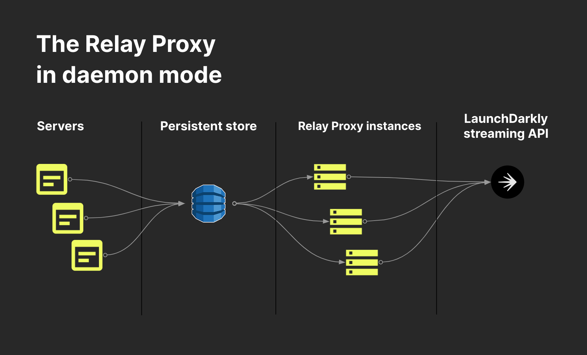

# LaunchDarkly Relay Proxy - Daemon Mode

[(back to README)](../README.md)

Optionally, you can configure our SDKs to communicate directly to the [persistent store](./persistent-storage.md). If you go this route, there is no need to put a load balancer in front of the Relay Proxy; we call this **daemon mode**. This is the preferred way to use LaunchDarkly with [./php.md](PHP) (as there's no way to maintain persistent stream connections in PHP).



In this example, the persistent store is in Redis. To set up the Relay Proxy in this mode, provide a Redis host and port, and supply a Redis key prefix for each environment in your configuration:

```
# Configuration file example

[Redis]
    host = "localhost"
    port = 6379
    localTtl = 30s

[Environment "Spree Project Production"]
    prefix = "ld:spree:production"
    sdkKey = "SPREE_PROD_SDK_KEY"

[Environment "Spree Project Test"]
    prefix = "ld:spree:test"
    sdkKey = "SPREE_TEST_SDK_KEY"
```

```
# Environment variables example

USE_REDIS=1
REDIS_HOST=localhost
REDIS_PORT=6379
CACHE_TTL=30s
LD_ENV_Spree_Project_Production=SPREE_PROD_SDK_KEY
LD_PREFIX_Spree_Project_Production=ld:spree:production
LD_ENV_Spree_Project_Test=SPREE_TEST_SDK_KEY
LD_PREFIX_Spree_Project_Test=ld:spree:test
```

(The per-environment "prefix" setting can be used the same way with Consul or DynamoDB. Alternately, with DynamoDB you can use a separate table name for each environment.)

The `localTtl`/`CACHE_TTL` parameter controls the length of time that the Relay Proxy will cache data in memory so that feature flag requests do not always hit the database; see [Persistent Storage](./persistent-storage.md).

You will then need to [configure your SDK](https://docs.launchdarkly.com/sdk/concepts/feature-store#using-a-persistent-feature-store-without-connecting-to-launchdarkly) to connect to Redis directly.

Using daemon mode does not prevent you from also using [proxy mode](./proxy-mode.md) at the same time, for SDKs that cannot connect to a database (such as mobile SDKs).
